# BrutalPrinceJS

Play the game at [https://brutalprince.com/](https://brutalprince.com/).

Forked from [oklemenz/PrinceJS](https://github.com/oklemenz/PrinceJS). Thanks to Oliver Klemenz and the PrinceJS contributors for the original game! Everything added in this fork is pure AI vibecoding.

## Gameplay screenshots

Captured from the real game with sound muted. Combat scenes are staged with the repository's browser playtest helpers so the actions and their effects are easy to see; they use the actual weapons, animations, collision physics and level scenery.

### Twin torches: burn everyone within reach

Hold `CTRL` / `F` with `1` selected to spin both torches. These guards are already out of the fight, but their burning bodies keep running before collapsing.

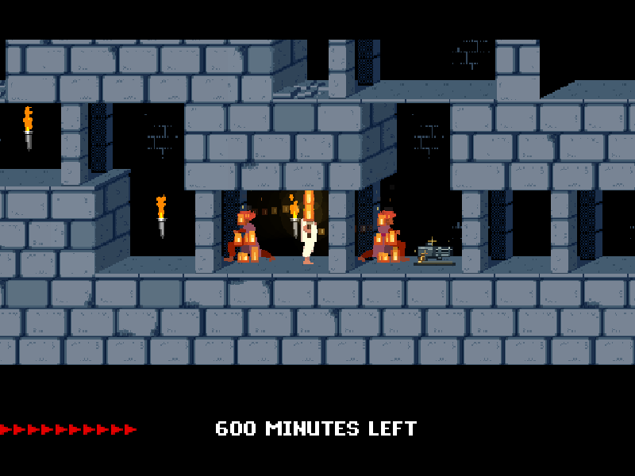

### Molotov: throw, ignite, or drop from a ledge

Charge and release a throw to send a burning bottle toward the guards. Its impact leaves real ground fire that ignites them.

| Bottle in flight                                                                             | Guards burning in the ground fire                                                                                 |
| -------------------------------------------------------------------------------------------- | ----------------------------------------------------------------------------------------------------------------- |
| 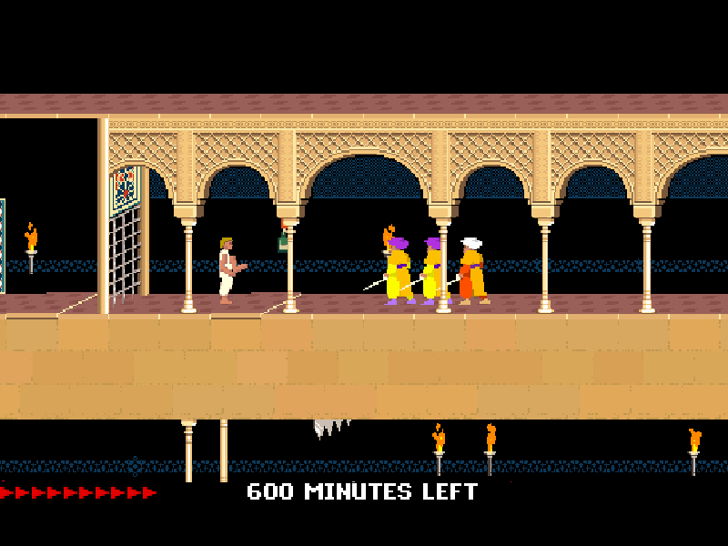 | 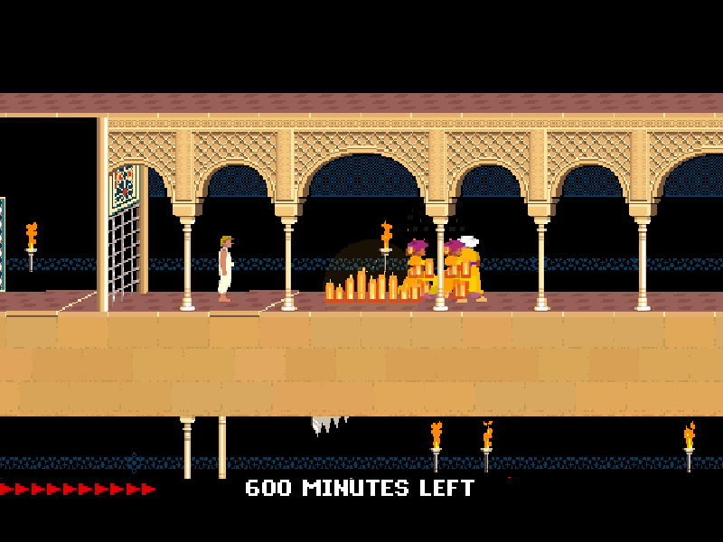 |

While hanging, press `CTRL` / `F` to light and drop the bottle below without letting go of the ledge.

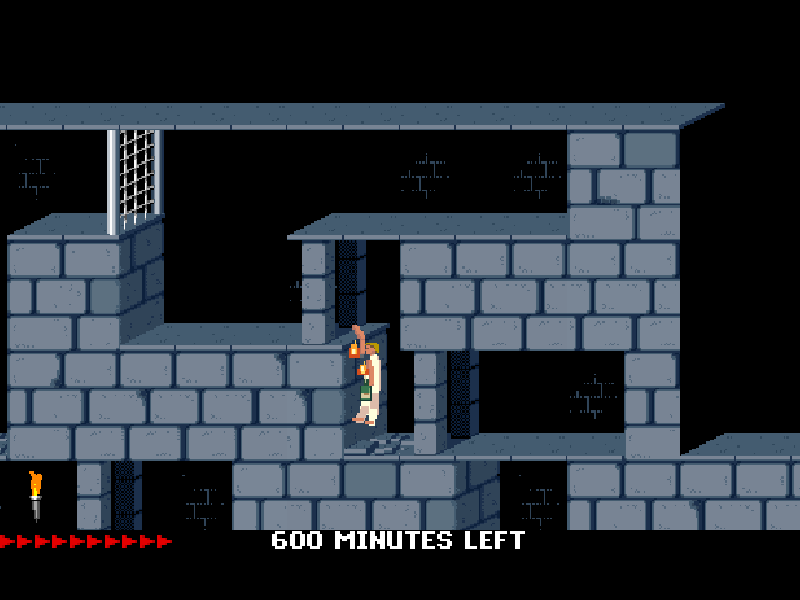

### Minigun: rapid fire and varied deaths

Hold the trigger to cut through a crowd. Minigun kills cycle through tumbling face hits, torn arms, waist splits, severed heads and leg collapses; spent casings collect on the floor.

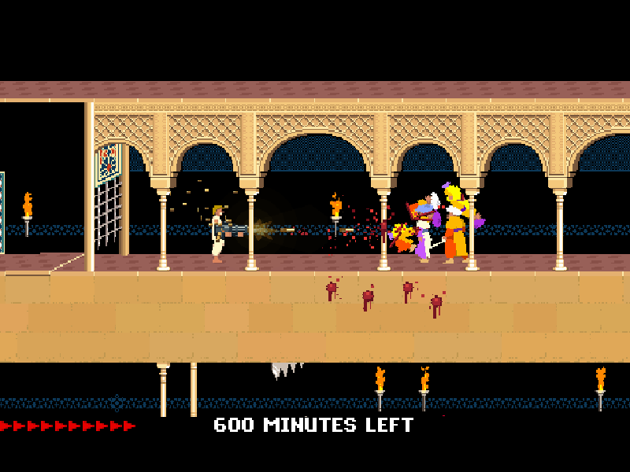

### Rocket launcher: explosive dismemberment

Rockets accelerate into their targets and scatter body parts through the surrounding room. Fragments collide with the scenery and leave blood behind.

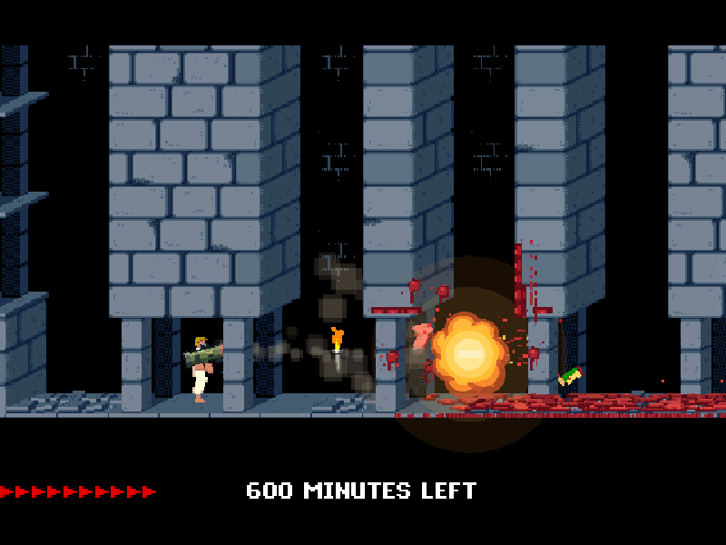

### Rocket launcher: break the exit and keep going

A rocket can shatter the next-level exit into flying fragments. The damaged doorway stays open and usable. Arrival doors remain protected.

| Exit destruction                                                                                                    | The permanent, usable breach                                                                                          |
| ------------------------------------------------------------------------------------------------------------------- | --------------------------------------------------------------------------------------------------------------------- |
| 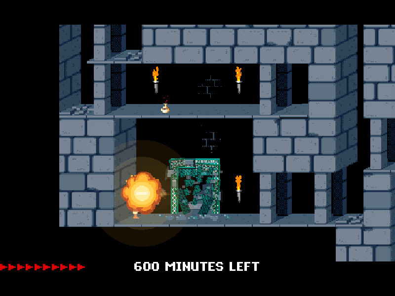 | 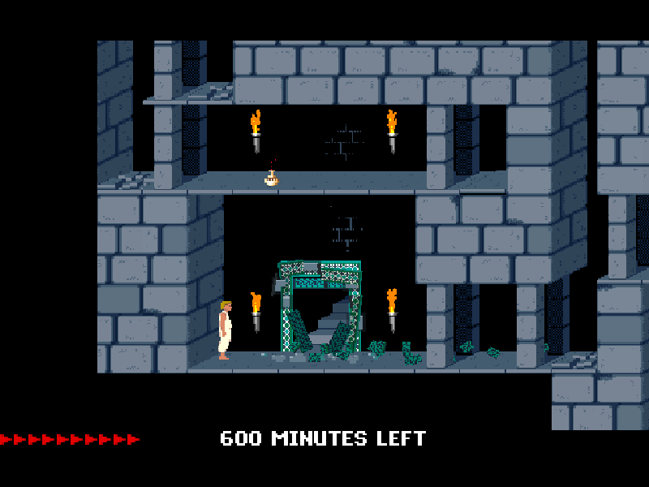 |

### Whip: strike or pull an enemy off a ledge

`X` can finish a weakened guard with a direct lash, or catch an enemy above you by the ankle and pull them into a real gap. A short fall costs a life and leaves them recovering; longer drops can be fatal.

| A lethal direct strike                                                                     | An ankle caught above a gap                                                                                          |
| ------------------------------------------------------------------------------------------ | -------------------------------------------------------------------------------------------------------------------- |
| 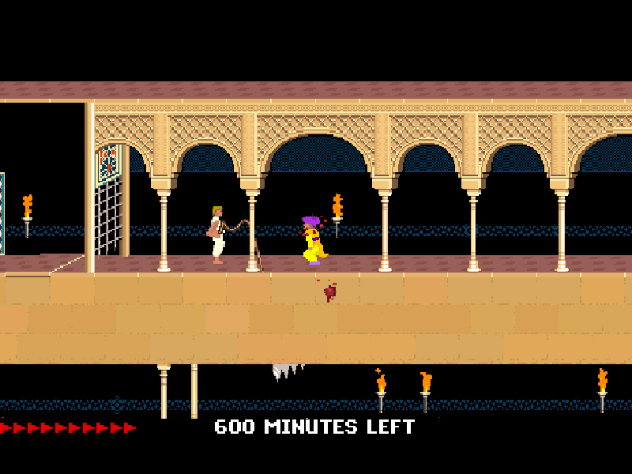 | 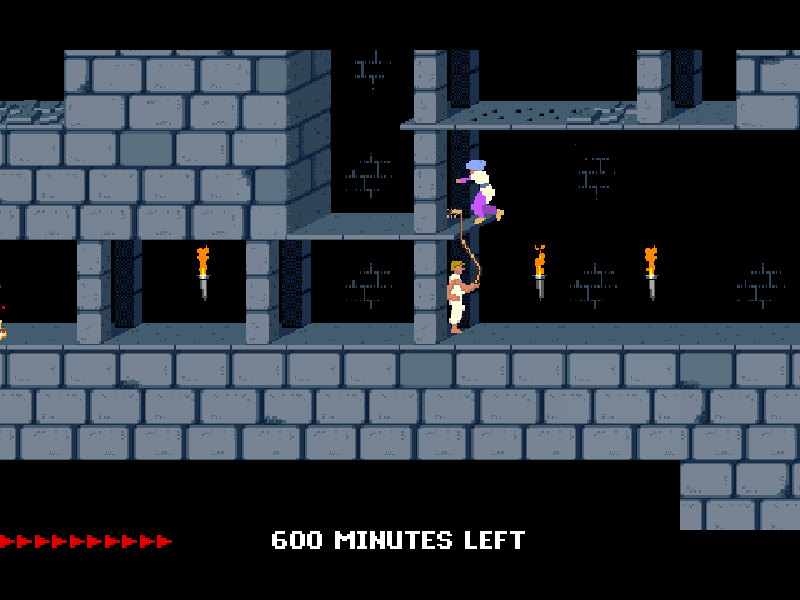 |

### Roundhouse kick: make some room

`C` launches nearby guards and can start a body-to-body knockdown. The blood is cosmetic: the kick itself does not remove HP. Guards recover after landing, while traps and fatal drops keep their normal effects.

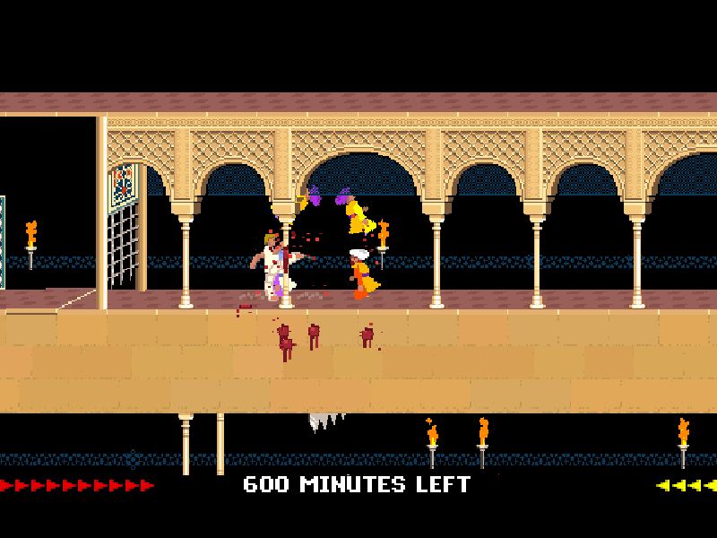

### Jetpack: take the upper route

From level 12, collect the jetpack, equip it with `J` and fly with the arrow keys. Hover between platforms or break loose floor slabs from below.

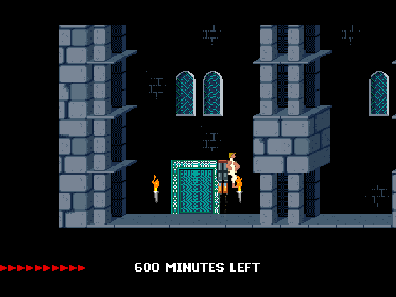

### The aftermath stays

Blood stains, fallen body parts and brass remain throughout the level, even after leaving and revisiting the room. Restarting or changing levels clears them.

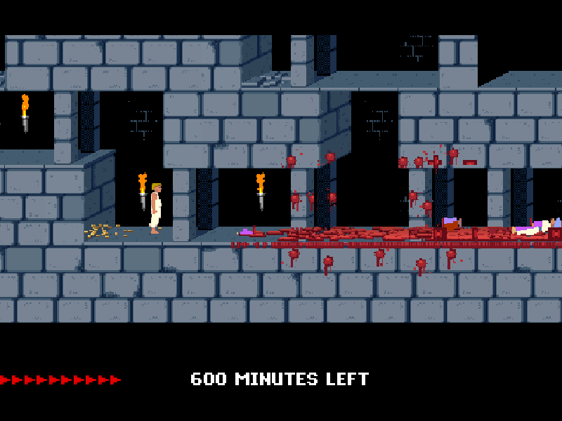

## Play

Run `npm install` and `npm start`, then open the local address printed by the server (usually `http://localhost:8080`).

## Controls

| Key          | Action                                                       |
| ------------ | ------------------------------------------------------------ |
| Arrow keys   | Move, jump, crouch and climb; fly with the jetpack.          |
| `SHIFT`      | Walk, grab ledges and drink potions.                         |
| `1`–`4`      | Select twin torches, molotov, minigun or rocket launcher.    |
| `CTRL` / `F` | Use the selected weapon; release to throw a charged molotov. |
| `X` / `C`    | Whip / roundhouse kick.                                      |
| `J` / `ESC`  | Toggle the jetpack / open settings and controls.             |

Torches start in level 1; collect the molotov and minigun there, the whip and rocket launcher in level 2, and the jetpack in level 12. Equipment carries forward. The kick is always available. Rockets can destroy walls and exits without blocking progress.

The game also has persistent blood and casings, tougher crowds, healing and maximum-health potions, a wider camera, contextual tutorials, and optional touch controls. The intro adds a bloody **Brutal** above the original title.

Exit-door tutorials in levels 2 and 3 teach selecting the rocket launcher with `4` and blasting the doors with `Ctrl` / `F`. Collecting the jetpack in level 12 explains `J` to equip or remove it and the arrow keys to fly.

See [the project rules](ruleset.md) and [tutorial documentation](docs/tutorials.md) for details.
